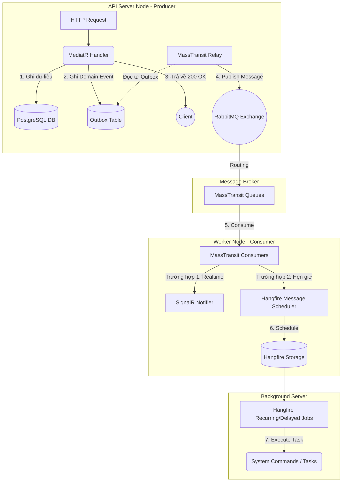

# BACKGROUND JOBS & ASYNC PROCESSING ARCHITECTURE
**Tài liệu Đặc tả Kiến trúc Xử lý Bất đồng bộ (Producer - Consumer Model)**

Tài liệu này mô tả chi tiết thiết kế hệ thống xử lý nền (Background Processing) và thông điệp bất đồng bộ (Asynchronous Messaging) trong dự án Bidding Online. Hệ thống sử dụng **RabbitMQ** (được trừu tượng hóa qua MassTransit) làm Message Broker và **Hangfire** để quản lý các tác vụ lên lịch/định kỳ.

---

## 1. Architecture Decisions (Quyết định Kiến trúc)

Trong hệ thống đấu giá trực tuyến, việc xử lý mọi tác vụ đồng bộ (Synchronous) trong một HTTP Request sẽ dẫn đến:
1. **Response Time chậm:** Client phải chờ server gửi email, tính toán kết quả đấu giá, hoặc gọi 3rd-party API (Payment Gateway).
2. **Nguy cơ mất dữ liệu (Data Loss):** Nếu server crash trong lúc đang xử lý các tác vụ phụ trợ, dữ liệu/trạng thái có thể bị gián đoạn vĩnh viễn.
3. **Thắt cổ chai (Bottleneck):** Tài nguyên Web Server bị cạn kiệt do phải giữ các Thread chờ I/O operations.

**Giải pháp của chúng tôi:**
*   **Decoupling (Giảm kết dính):** Áp dụng mô hình **Producer - Consumer**. API Server (Producer) chỉ làm nhiệm vụ xác nhận tính hợp lệ của logic lõi, ghi vào Database và đẩy Message/Event đi. Worker Server (Consumer) sẽ nhận Message và xử lý các tác vụ nặng ở chế độ nền (Non-blocking).
*   **Transactional Outbox Pattern:** Tích hợp `EntityFrameworkOutbox` của MassTransit. Đảm bảo tính nhất quán (Consistency) tuyệt đối: Event chỉ được đẩy ra RabbitMQ khi và chỉ khi Database Transaction Commit thành công.
*   **Fault Tolerance & Retry Mechanism:** Sử dụng cơ chế Retry (Exponential Backoff), Circuit Breaker của MassTransit và tự động Retry của Hangfire. Nếu xử lý lỗi, hệ thống sẽ tự động thử lại mà không làm ảnh hưởng đến trải nghiệm của End-user.

---

## 2. Sơ đồ Luồng Dữ Liệu (Data Flow Diagram)



---

## 3. Cấu hình Hạ tầng (Infrastructure Configuration)

Dựa trên mã nguồn tại `L3.Worker/Extensions/`, hệ thống thiết lập cấu hình như sau:

### 3.1. RabbitMQ & MassTransit (`MassTransitExtensions.cs`)
Hệ thống không can thiệp thủ công tạo Queue/Exchange mà ủy quyền cho MassTransit tự động quản lý Topology (Routing) dựa trên tên Consumer.

*   **Outbox Pattern:** Cấu hình `AddEntityFrameworkOutbox<AppDbContext>` với thời gian nhận diện trùng lặp `DuplicateDetectionWindow = 30 mins`.
*   **Message Retry:** Sử dụng chiến lược `Exponential(4, 1s, 10s, 2s)`. Thử lại tối đa 4 lần, độ trễ tăng dần theo hàm mũ.
*   **Delayed Redelivery:** Nếu vẫn thất bại sau chuỗi Retry ngắn hạn, đưa vào hàng đợi chờ xử lý lại ở cấp độ vĩ mô với các mốc: `5 phút`, `15 phút`, `30 phút`.
*   **Circuit Breaker:** Ngắt mạch nếu có lỗi liên tục (`TripThreshold = 15`, `ActiveThreshold = 10`) để bảo vệ các dịch vụ phụ thuộc khỏi hiện tượng Cascading Failure.

### 3.2. Hangfire (`HangfireExtensions.cs` & `HangfireBootstrapper.cs`)
*   **Job Storage:** Sử dụng chính PostgreSQL (`UsePostgreSqlStorage`) để lưu trữ metadata của các Background Jobs, tối ưu hóa chi phí hạ tầng (không cần chạy thêm DB riêng).
*   **Bootstrapper:** Class `HangfireBootstrapper` hoạt động như một `IHostedService` để tự động nạp các `RecurringJob` (Cron Jobs) ngay khi Worker khởi động. Múi giờ được set cứng theo chuẩn `Asia/Ho_Chi_Minh` (SE Asia Standard Time).

---

## 4. Chi tiết Thực thi và Use Cases Thực Tế

### 4.1. Publisher (Producer) - Phát rải Sự kiện
*   **Nguồn phát:** Lớp `L1.Core`. Mọi Entity khi thay đổi trạng thái sẽ gọi hàm `AddDomainEvent()`.
*   **Dispatcher:** Class `MassTransitEventDispatcher` (thuộc `L3.Worker/Adapters/Notification/`). Nó chặn (intercept) tiến trình SaveChanges của Entity Framework, lấy toàn bộ `DomainEvent` và gọi `IPublishEndpoint.Publish()`.

### 4.2. Use Case 1: Xử lý Hẹn giờ thông qua Scheduled Messages
**Ngữ cảnh:** Khi Admin tạo và "Publish" một phiên đấu giá (Auction Session), hệ thống cần phải tự động khởi động (Live) phiên vào đúng `StartTime` và đóng (Close) phiên vào `EndTime`.

**Luồng chạy:**
1. Trạng thái Aggregate `AuctionSession` đổi thành `Published` -> Phát ra `SessionPublishedEvent`.
2. **Consumer:** `SessionPublishedConsumer` nhận event.
3. Thay vì xử lý ngay, Consumer sử dụng `IMessageScheduler` của MassTransit (tích hợp Hangfire) để lên lịch tương lai:
   ```csharp
   await scheduler.SchedulePublish(msg.StartTime, new StartSessionCommand(msg.Id));
   await scheduler.SchedulePublish(msg.EndTime, new EndSessionCommand(msg.Id));
   ```
4. Khi đến giờ, Hangfire trigger MassTransit đẩy Message xuống. **Consumer:** `CommandConsumer` bắt `StartSessionCommand` / `EndSessionCommand` và đẩy cho MediatR Handler thực thi logic DB.

### 4.3. Use Case 2: Fire-and-Forget Jobs (Tác vụ Gửi Email)
**Ngữ cảnh:** Người dùng yêu cầu khôi phục mật khẩu. Việc gửi email qua giao thức SMTP thường mất 1-3 giây. API không được phép block chờ.

**Luồng chạy:**
1. Giao diện Port: `ITaskQueue` được gọi từ `AuthService.cs`.
2. **Adapter (Producer):** `HangfireTaskQueue` implement interface này. Gọi `jobClient.Enqueue(workItem)`.
3. Worker (Hangfire) ngay lập tức gắp Job chứa biểu thức `IEmailService.SendResetPasswordEmailAsync` và thực thi độc lập ở chế độ nền. API trả về `200 OK` ngay lập tức.

### 4.4. Use Case 3: Event-Driven Realtime Notifications
**Ngữ cảnh:** Phiên đấu giá kết thúc, hệ thống cần thông báo Real-time cho Seller và Bidder.

**Luồng chạy:**
1. Logic DB kết thúc phiên -> Sinh ra `AuctionEndedEvent`.
2. **Consumer:** `AuctionEndedConsumer` (trong `L3.Worker/Consumers/Bidding/`) bắt sự kiện này.
3. Consumer gọi vào các giao diện `IAuctionNotifier`, `IBidderNotifier`, `ISellerNotifier` (Được implement bởi các SignalR Adapters).
4. SignalR đẩy Notification trực tiếp qua WebSockets tới trình duyệt của End-user.

### 4.5. Use Case 4: Recurring Jobs (Tác vụ Quét Định Kỳ / Cron Jobs)
**Ngữ cảnh:** Cần dọn dẹp hệ thống, kiểm tra người chiến thắng không thanh toán, dọn rác ổ cứng. Các job này được định nghĩa tại `L3.Worker/Jobs/` và đăng ký tại `HangfireBootstrapper`.

*   **`UnpaidWinnerTimeoutJob` (Chạy mỗi giờ):** Quét CSDL tìm các `Auction` ở trạng thái `EndedSold` quá 1 ngày nhưng chưa có Order thanh toán -> Đánh dấu thất bại, trả item về trạng thái chưa bán.
*   **`SoftDeletePurgeJob` (Chạy 3h sáng mỗi ngày):** Xóa vĩnh viễn (Hard Delete) các Category, CatalogItem đã bị Soft Delete (`IsDeleted = true`) quá 30 ngày.
*   **`ImageCleanupJob` (Chạy 2h sáng mỗi ngày):** So khớp file vật lý trên thư mục upload và DB. Xóa các hình ảnh rác/ảnh orphaned không còn liên kết trong DB để giải phóng dung lượng.
*   **`StartupSyncJob` (Chạy 1 lần sau 30s khởi động hệ thống):** Khắc phục sự cố. Nếu Server tắt đột ngột và lỡ mất mốc thời gian `StartTime`/`EndTime` của Session, job này quét và đồng bộ lại trạng thái. Bảo vệ đồng bộ bằng Lock `[DisableConcurrentExecution(300)]`.
